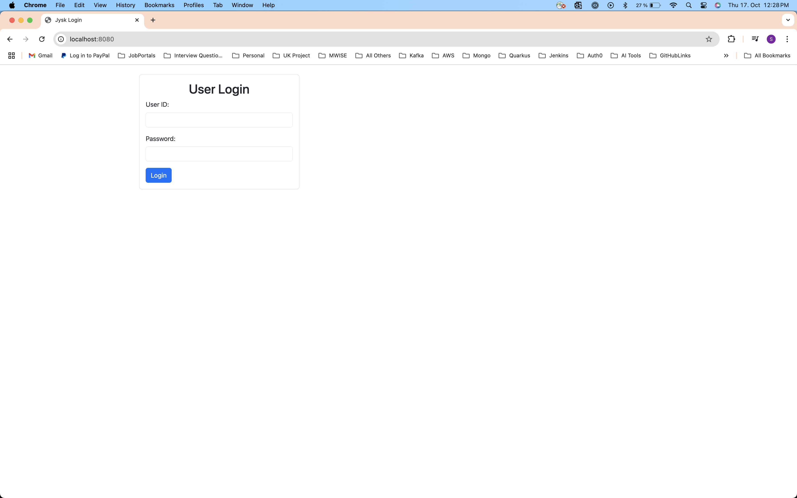
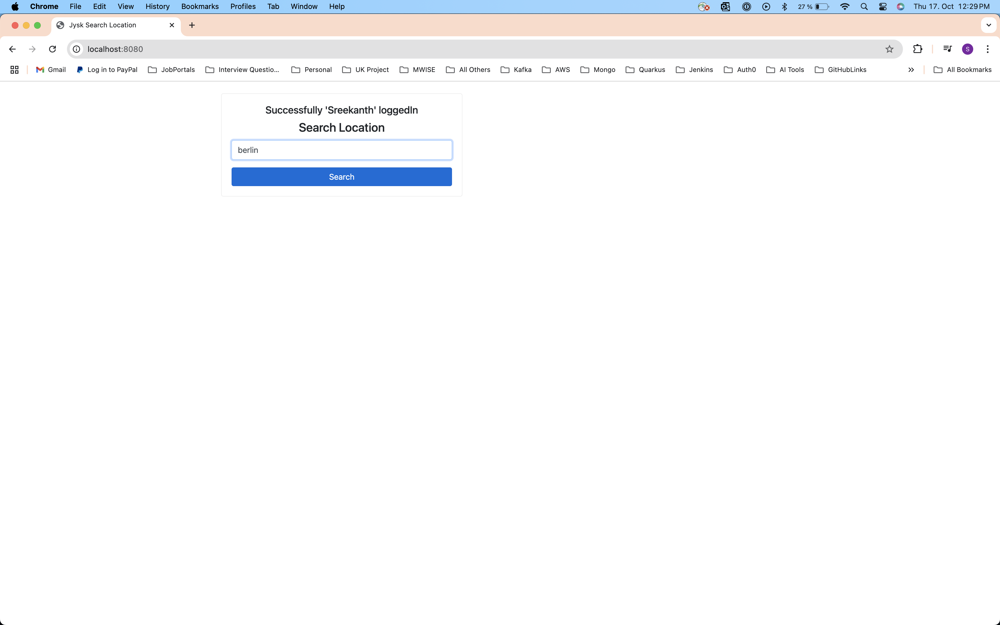
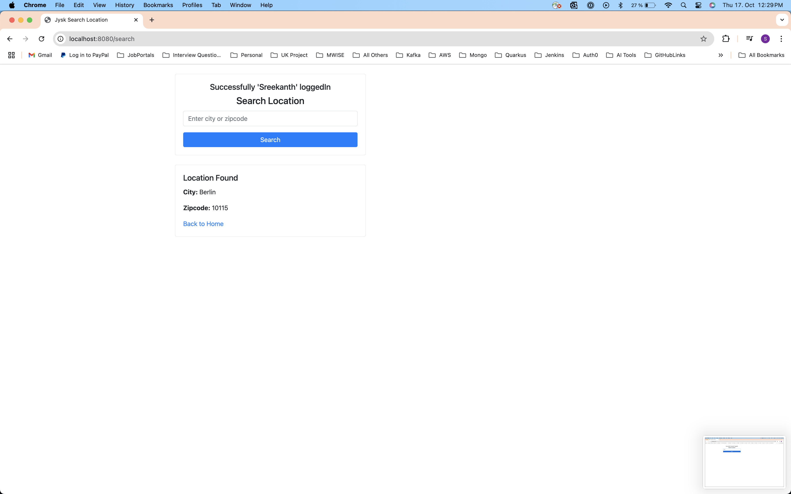
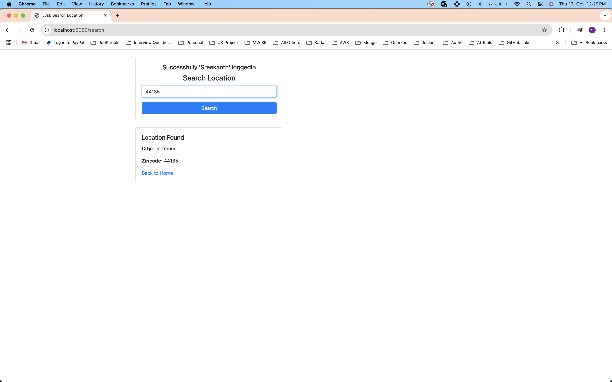
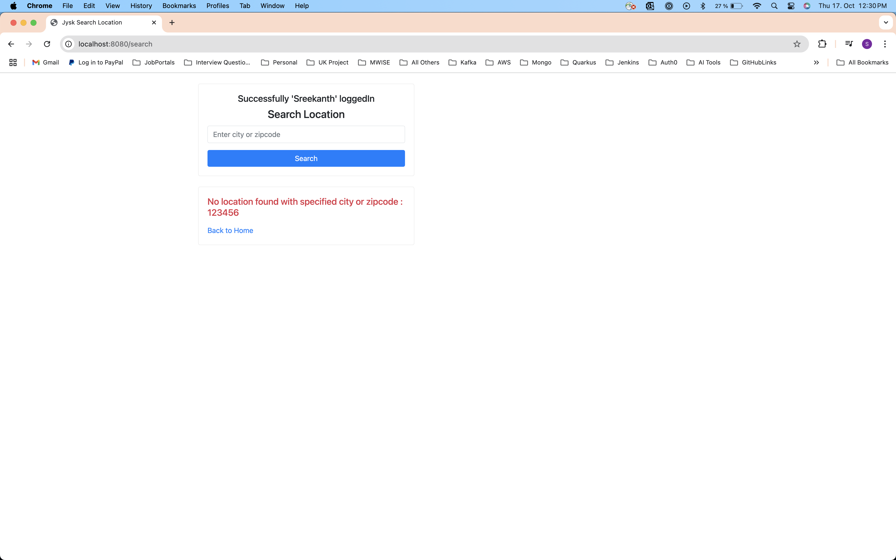

# Location Search Case Study

### Problem Statement
```
1. The user receives a login page through which he can log in with userId and password (no attention should be paid to appearance).
2. For this special task, any combination of userId and password entered should be accepted as valid. 
The logged in users are logged using a suitable Java logging framework.
3. After login, the user should be able to carry out a search using a ZIP code or city name from a list of locations held in memory at runtime. 
Only direct hits lead to a positive result, which is then displayed to the user.
4. In the negative case, a corresponding error message is displayed.
```

### Location search project is implemented using the Spring framework, written all possible test cases, 98% test lines coverage achived and created Dockerfile to deploy application in local docker.
### TechStacks Used
```
Java 17,
SpringBoot MVC,
Thymeleaf,
BootStrap,
Docker
```

### Steps to Run the application
```
./gradlew clean  - run this command to clean all existing built files.
./gradlew bootRun - run this command to start the application.
```

### Steps to Dockerized the application
```
./gradlew test  - run this command to execute all test cases.
./gradlew clean  - run this command to clean all existing built files.
./gradlew build  - run this command before dockerize the application.
docker build -t location-search . - execute this command to build the docker image.
docker run --name location-search -d -p 8080:8080 location-search - execute this command to run the builded docker image.
Note: To build or run(execute) docker image, docker need to be installed on host machine.
```

### In-Memory Location Details
```
    CityName: Berlin, Zipcode: 10115
    CityName: Handewitt, Zipcode: 24983
    CityName: Hamburg, Zipcode: 20095
    CityName: Munich, Zipcode: 80331
    CityName: Cologne, Zipcode: 50667
    CityName: Frankfurt, Zipcode: 60311
    CityName: Stuttgart, Zipcode: 70173
    CityName: Dusseldorf, Zipcode: 40213
    CityName: Leipzig, Zipcode: 04109
    CityName: Dortmund, Zipcode: 44135
```

Login URL: http://localhost:8080/

UI Screens FYR.







### GitHub Actions

Implemented the CI-CD GitHub Actions.
1. Automatically Build the Application When code commit to **main** branch.
2. Automatically Push the Builded application to DockerHub.

### Kubernetes Deployment

Added Kubernetes Deployment File to
1. Pull the Latest Image from DockerHub.
2. Deploy the Application in the Minikube cluster.
